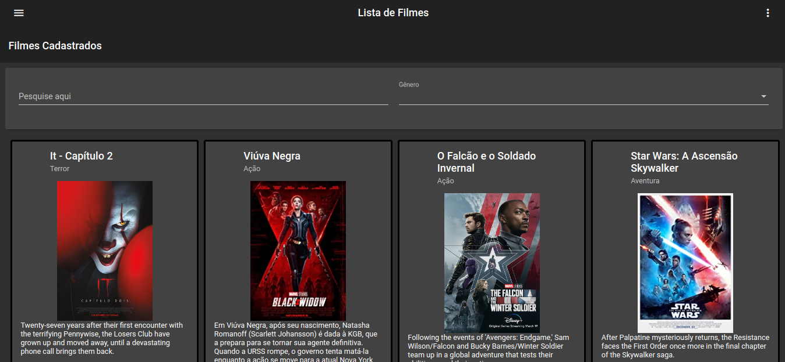
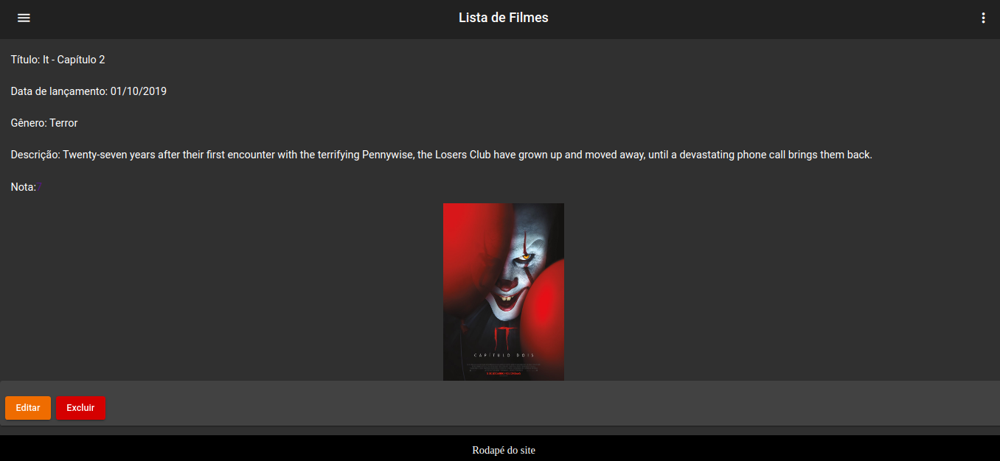
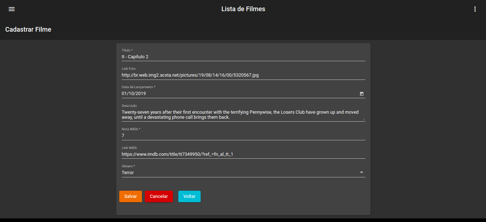
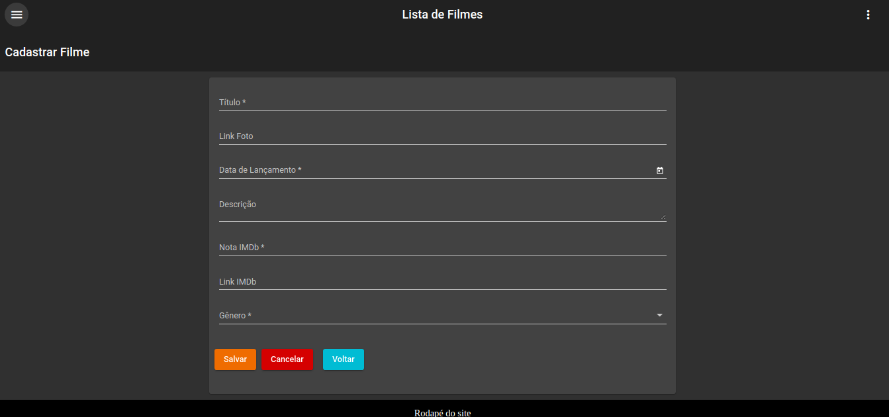

## Gerenciador de Filmes
Uma aplicação CRUD criada com o objetivo de gerenciar filmes, usando Angular 8+

## Tecnologias
- Angular (Rotas/Material/RxJS)
- Javascript
- NodeJS
- TypeScript
- CSS
- HTML

## Imagens

- Listagem de Filmes

- Visualização do Filme

- Edição do Filme

- Menu Lateral

- Cadastro de Filme

## Instalação

1. clone o repositório `git clone git@github.com:PabloChristian/gerenciador-filmes.git`
2. Entre no projeto e instale as dependencias `npm install`

## Ambiente Local

Execute `ng serve` para que o projeto suba localmente. Acesse a url `http://localhost:4200/`. O projeto já está com reload automático conforme as alterações que você realizar no código

## Simulando o Back-end

Execute `npm install -g json-server` para instalar globalmente o servidor json. Após a instalação entre na pasta do projeto e execute `json-server --watch db.json`, com isso um servidor será inicializado na url `http://localhost:3000/`, após a inicialização sera possível realizar requisições http.

## Gerando componente

Digite `ng generate component nome-do-componente` para criar um novo componente. Você também pode usuar `ng generate directive|pipe|service|class|guard|interface|enum|module`.

